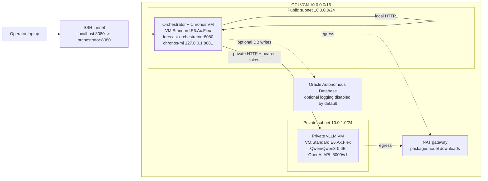
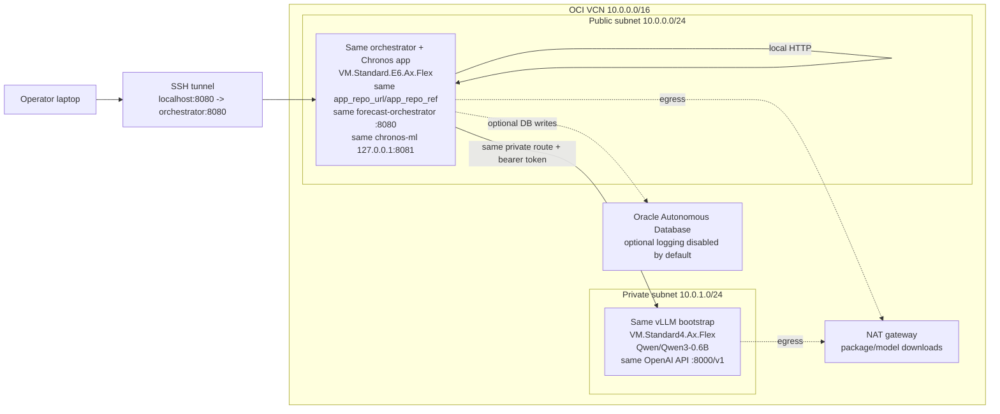

# OCI Forecasting MVP

Zero-shot time-series forecasting on OCI Compute with:

- `autogluon/chronos-2-small` for probabilistic forecasts and covariates
- a separate Qwen/vLLM endpoint for explanations and recommendations
- FastAPI orchestration with JSON, Markdown, and enriched CSV output
- deterministic numeric and template language fallbacks
- Python virtual environments and `systemd`, without containers

Chronos-2 is pinned to revision `ddec01313e50b6bc58ebaa92ede81bc24a3d9f9a` through `chronos-forecasting==2.3.1`. The original `amazon/chronos-t5-small` adapter remains available for environment-only rollback.

## Architecture

```text
Client
  -> forecast orchestrator :8080
       -> Chronos ML service 127.0.0.1:8081
       -> Qwen/vLLM private endpoint :8000/v1
       -> Oracle Autonomous Database (optional)
```

The orchestrator accepts one target series per request. Chronos-2 can use numeric, categorical, or boolean historical covariates and known-future covariates without training on the submitted dataset.

See [Architecture](docs/architecture.md) for the request and failure flows.

## Scenario Deployment Guide

The architecture demo proves that the same AI application can run on different
OCI CPU shapes without changing Python app code. Deploy the scenarios one at a
time and keep each Terraform workspace/state separate.

Do not commit `terraform.tfvars`, Terraform state, saved plans, private keys, or
generated API keys. Keep `public_api_cidr_blocks = []` unless authenticated
ingress has been added; use an SSH tunnel for validation.

### Scenario 01: AMD Baseline

Scenario 01 deploys the baseline two-VM stack with AMD E6 flexible shapes. The
orchestrator VM hosts the FastAPI app and Chronos-2 service; the private vLLM VM
hosts Qwen through vLLM's OpenAI-compatible API.



From the Terraform directory, create a private base config:

```bash
cd infra/terraform
cp terraform.tfvars.example terraform.tfvars
```

Set private values in `terraform.tfvars`: compartment, availability domain, SSH
key path, admin CIDR, app repo/ref, and model settings. For the AMD baseline,
keep the default shapes:

```hcl
orchestrator_shape = "VM.Standard.E6.Ax.Flex"
vllm_shape         = "VM.Standard.E6.Ax.Flex"
```

Use the default workspace for Scenario 01:

```bash
terraform init
terraform workspace select default
terraform fmt -check -recursive
terraform validate
terraform plan
terraform apply
```

After apply, validate the baseline:

```bash
terraform output
ssh opc@<orchestrator-public-ip>
sudo cloud-init status --wait
sudo systemctl --no-pager --full status chronos-ml.service
sudo systemctl --no-pager --full status forecast-orchestrator.service
curl -fsS http://127.0.0.1:8080/health | python3 -m json.tool
```

Check the private vLLM route from the orchestrator network path:

```bash
curl -fsS http://<vllm-private-ip>:8000/v1/models \
  -H "Authorization: Bearer <redacted-key>" | python3 -m json.tool
```

Then run a `/predict` smoke through the orchestrator. A successful Scenario 01
response reports `ml_output.engine="chronos"`,
`ml_output.model_family="chronos2"`, and non-fallback Qwen explanation and
recommendation output.

### Scenario 02: Intel Recreation

Scenario 02 recreates the same stack with the same application repo/ref and the
same cloud-init bootstrap path, but changes the private vLLM VM to Intel
`VM.Standard4.Ax.Flex`. This is the key experiment: the app code remains the
same, while the infrastructure input selects a different CPU family.



Keep the private `terraform.tfvars` from Scenario 01, then create or select a
dedicated Scenario 02 workspace:

```bash
cd infra/terraform
terraform workspace new scenario02-intel
```

If the workspace already exists:

```bash
terraform workspace select scenario02-intel
```

Verify the active workspace before planning:

```bash
terraform workspace show
```

The workspace name must be `scenario02-intel`. Plan with the non-secret Intel
overlay:

```bash
terraform fmt -check -recursive
terraform validate
terraform plan -var-file=scenario02-intel.tfvars.example
```

The tracked overlay changes only the scenario resource prefix, the vLLM shape,
and public API exposure:

```hcl
project_name            = "oci-vllm-ml-inference-s02-intel"
vllm_shape              = "VM.Standard4.Ax.Flex"
public_api_cidr_blocks = []
```

Review the plan before applying. It should create an isolated Scenario 02 stack
and must not mutate the Scenario 01 AMD workspace. If the selected availability
domain lacks `VM.Standard4.Ax.Flex` capacity, try another availability domain
before choosing a different Intel shape.

After apply, run the same validation gates as Scenario 01, plus confirm the CPU
vendor on the vLLM host:

```bash
ssh -J opc@<orchestrator-public-ip> opc@<vllm-private-ip>
lscpu
sudo cloud-init status --wait
sudo systemctl --no-pager --full status vllm-openai.service
```

Then repeat `/v1/models` and `/predict` validation. Scenario 02 passes when the
Intel vLLM host reports `GenuineIntel`, the private vLLM endpoint returns
`Qwen/Qwen3-0.6B`, and the same orchestrator app returns Chronos-2 output with
non-fallback Qwen explanation and recommendations.

### What Stayed The Same

Both scenarios use the same Python application code, same service boundaries,
same app installation flow, same cloud-init templates, and same vLLM
OpenAI-compatible service contract:

```text
Client -> orchestrator :8080
orchestrator -> Chronos service 127.0.0.1:8081
orchestrator -> private vLLM endpoint :8000/v1
```

The Scenario 02 proof is that changing `vllm_shape` from AMD E6 to Intel
Standard4 recreates the app successfully without changing `ml_service/`,
`orchestrator_api/`, or `llm_service/`.

## Repository

- `ml_service/` - Chronos-2 service and deterministic fallback
- `orchestrator_api/` - public prediction and CSV APIs
- `llm_service/` - OpenAI-compatible vLLM client
- `forecast_contract.py` - shared covariate validation
- `deploy/` - installer and systemd units
- `infra/terraform/` - optional two-VM OCI scaffold
- `examples/` - sample forecast inputs
- `tests/` - unit and opt-in integration tests

## Try The Deployed API

For a private orchestrator VM, open an SSH tunnel from your laptop:

```bash
ssh -L 8080:127.0.0.1:8080 opc@<orchestrator-address>
```

Leave that terminal open. In another terminal:

```bash
curl -fsS http://127.0.0.1:8080/health | python3 -m json.tool
```

Send a covariate-aware forecast:

```bash
curl -fsS -X POST http://127.0.0.1:8080/predict \
  -H 'Content-Type: application/json' \
  -d '{
    "series_id": "demand-demo",
    "timestamps": ["2026-07-01", "2026-07-02", "2026-07-03", "2026-07-04"],
    "values": [120, 127, 131, 138],
    "prediction_length": 2,
    "past_covariates": {
      "promotion": [0, 0, 1, 1],
      "region": ["north", "north", "north", "north"]
    },
    "future_covariates": {
      "promotion": [1, 0],
      "region": ["north", "north"]
    },
    "future_timestamps": ["2026-07-05", "2026-07-06"],
    "notes": "Promotion ends after the first forecast day."
  }' | python3 -m json.tool
```

A successful response reports `ml_output.engine="chronos"`, `ml_output.model_family="chronos2"`, and the supplied names in `ml_output.covariates_used`.

## CSV And Markdown

The sample [Chronos-2 covariate CSV](examples/chronos2_covariate_test.csv) contains 12 observed rows and three trailing future rows with blank targets.

```bash
curl -fsS -X POST http://127.0.0.1:8080/predict/csv \
  -F "file=@examples/chronos2_covariate_test.csv;type=text/csv" \
  -F "date_column=date" \
  -F "target_column=demand" \
  -F "series_id=csv-demand-demo" \
  -F "prediction_length=3" \
  -F "response_format=markdown"
```

`response_format` may be `json`, `markdown`, or `csv`. For CSV input:

- non-date/non-target columns are candidate covariates;
- trailing blank-target rows are known-future rows and must equal `prediction_length`;
- incomplete historical columns remain available to presentation and LLM context but are excluded from model input with a warning.

## Tests

The ordinary suite uses fake pipelines and does not download model weights:

```bash
./.venv/bin/python -m pytest -m 'not integration'
```

The real checkpoint test is opt-in:

```bash
python3 -m pip install -r requirements-dev.txt -r requirements-ml.txt
RUN_CHRONOS_INTEGRATION=1 python3 -m pytest -m integration tests/test_chronos_integration.py
```

## Operations

- [Chronos/vLLM Explainer](docs/chronos-vllm-explainer.md) - how numeric projections and language generation are separated
- [Runbook](docs/runbook.md) - deploy, update, smoke test, troubleshoot, rotate keys, and roll back
- [Validation](docs/validation.md) - architecture-focused smoke and non-fallback gates
- [Scenario records](docs/scenarios/README.md) - completed AMD/Intel recreation evidence and planned dual routing
- [Terraform](infra/terraform/README.md) - optional fresh two-VM OCI deployment

Do not expose port `8080` broadly without authenticated ingress. Keep Chronos port `8081` bound to localhost and the Qwen/vLLM endpoint private.
